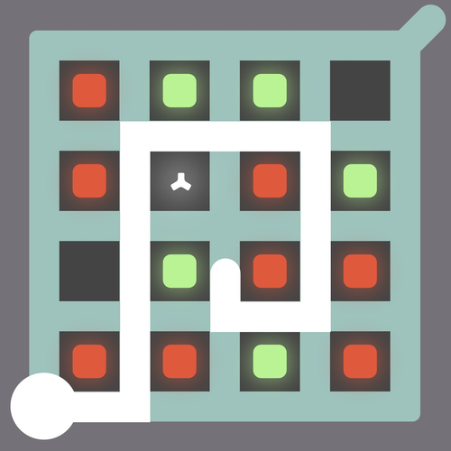

# Witness

A web mockup of a specific Witness puzzle with an extra reward tacked on for completion.

# Live Demo

[View Live Demo](https://strawstack.github.io/Witness/)

# Screenshot

# How to Make a Custom Secret Message

1. Clone this Repo.
2. In `main.js`, edit the text that starts with `To create your own secret message...`.
3. Uncomment the line that you have just modified.
4. Open `index.html` in a browser.
5. Enter a correct solution to the puzzle.
6. Obtain your encoded message from the console.
7. Append your custom encoding to the url as follows:
`https://strawstack.github.io/Witness/?msg=[your_encoding_here]` (do not include the square brackets).
8. Visiting the URL, and solving the puzzle, will cause your secret message to be displayed.

# Todo

- [x] If you're inside an intersection within a certain radius then let let marker float free to avoid snapping to row/col
- [x] BUG: Start are click captures and holds mousemove event preventing marker from updating underneath start button
- [x] Implement `processLine` add/remove wayPoints
    - [x] Is player moving away or toward the final waypoint?
- [x] Implement `renderLine`
    - [x] SVG line through waypoints, and
    - [x] Final wayPoint to player
- [x] Implement `checkSolution`
    - [x] Hash wayPoints and XOR with secret
- [x] Implement correct `fadePuzzleLine`
- [x] Show box under puzzle with current decoded message

- [ ] Read encoded message from URL query parameters

- [ ] Make a script, so others can create their own encoded messages

- [ ] Line should stop on collision
    - [ ] Note: the mouse can leave below the collision and appear far away
    - [ ] Next wayPoint can only be one of three points
    - [ ] lastWayPoint to marker can only be a short straight line
